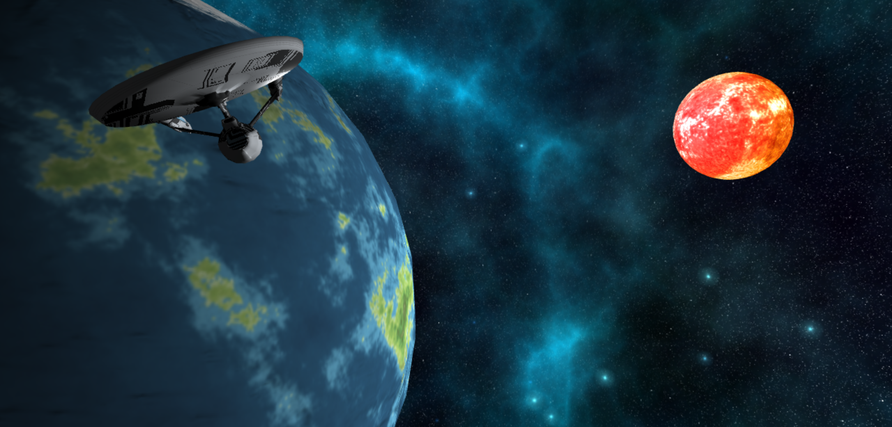

# Envy Rendering Engine

## About
This was originally an API that I wrote for the final project of my Computer Graphics class, but I have since expanded and added to it.  
It is built using WebGL 2 and vanilla javascript with GLSL for the shaders. By running the example, you can see a relatively complex scene rendered with relative ease.
There is much functionality left to be added like framebuffers and some bugs in some of the current effects like Environment Mapping, and those are on the roadmap to be fixed in the near future.
Feel free to fork, tweak, and use this with whatever purpose you want!

## Current Example Effects:
1. Normal Mapping: on the planet in the background
2. Gausian Blur: On the sun (it is hard to tell on the sun, so you can render your own object to see it better)
3. Environment Mapping: Cube map (Sky Box)

## Usage
This is an API that is used to create complex graphical scenes with much more ease than using WebGL itself.  
By looking at the example, you can see that it is easy to lead .obj 3D models, and you can apply textures and movements to them.  
You can also write your own shaders or use the ones that I have provided **They are still in progress**

Just include the files in your javascript project, and you will be able to call the api :)

## My Own Notes:
I want to say that this was an incredibly fun project that I will definitely continue to build on in the future.
Even though some of the effects are pretty cool, and I got some cool models to render, I would say that the coolest part of this project is the code design for sure.
I spent a lot of time designing the API for this, and it paid off in spades. It is now incredibly easy to make your own objects and shaders with this API.
I am going to spend some time writing some documentation, so that it might actually become a useful library for me in the future.
Overall, this was a ton of fun, and I had a blast creating this.
It has been an awesome class.

## NOTES FOR FUTURE:
* Create own file and class for textures to clean up their creation
* Add documentation for all methods and describe use cases for them
* ADD FRAMEBUFFER
